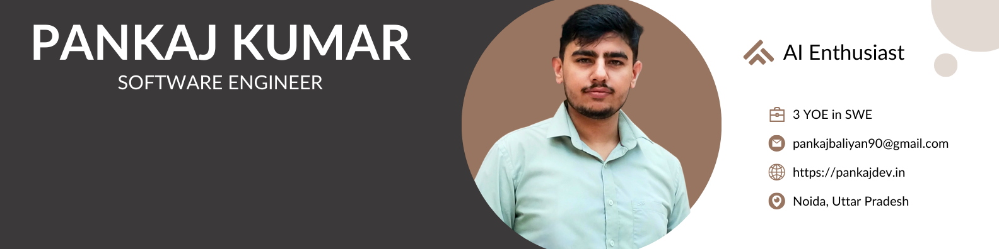

<h1 align="center">Hi 🙋‍♂️, I'm Pankaj Kumar</h1>
<h3 align="center">A passionate MERN Stack Web Developer from INDIA :india:</h3>

  

- 👋 Hi, I’m **<a href="https://github.com/PankajBaliyan">@PankajBaliyan</a>**

- 👀 I’m interested in **Web-Development, and Content Creator**

- 🌱 I’m regularly improving my skills in **Full Stack Web Development**

- ⚡ Fun fact I'm a huge fan of **Iron Man**, I love to eat and travel

- 💞️ I’m looking for **Web-Developer Projects**

- 🔭 I’m currently working on **[An independent project](https://github.com/PankajBaliyan?tab=repositories)**

- 📫 How to reach me **pankajbaliyan90@gmail.com**
  <li><g-emoji class="g-emoji" alias="rocket" fallback-src="https://github.githubassets.com/images/icons/emoji/unicode/1f680.png">🚀</g-emoji> I use daily: 👇   
  

  
  
  
  
  
  
  
  
  
  
  
  
  

</li>

<h3 align="left">Connect with me:</h3>

  

  

<h3 align="left">Languages and Tools:</h3>

 

