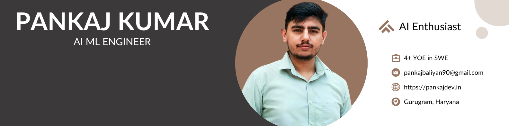

<h1 align="center">Hi 👋, I'm Pankaj Kumar</h1>

<h3 align="center">
AI ML Engineer • Full Stack • Building AI Products with LLMs, RAG & Computer Vision 🚀
</h3>

  

---

## 👨‍💻 About Me

- 🚀 Currently working as an **AI/ML Engineer at Questionlab Inc**
- 🧠 Building AI applications using **LLMs, RAG, LangChain & Vector Databases**
- 💻 Strong background in **Full Stack Development (React + Node.js + FastAPI)**
- 🔬 Interested in **Generative AI, NLP, Computer Vision & AI Infrastructure**
- 📚 Currently exploring advanced **Agentic AI Systems & Multi-modal AI**
- 🌍 Based in **India 🇮🇳**
- ⚡ Fun fact: Huge fan of **Iron Man** 😄

---

## 🚀 SaaS Products

<table>
<tr>
<td width="50%">

### ✨ SnippetVerse
A modern developer-focused platform to save, organize, and manage reusable code snippets efficiently.

🔗 Live Demo:  
https://snippetverse.pankajdev.in/

**Features**
- Code snippet management
- Clean developer-friendly UI
- Fast search & organization
- Productivity focused workflow

</td>

<td width="50%">

### ⚡ FetchTab
A lightweight productivity tool for managing and organizing browser tabs efficiently.

🔗 Live Demo:  
https://fetchtab.pankajdev.in/

**Features**
- Smart tab management
- Improved browsing productivity
- Minimal & fast interface
- Easy workflow organization

</td>
</tr>
</table>

---

## 🛠️ Tech Stack

### 👨‍🎨 Frontend

  
  
  
  
  

### ⚙️ Backend & APIs

  
  
  

### 🤖 AI / ML / NLP

  
  
  
  
  
  
  
  

### 🗄️ Databases

  
  
  
  

### 🧰 Tools & DevOps

  
  
  
  

---

## 🚀 Featured Projects

### 🩺 Medical RAG Chatbot
- Built an end-to-end **RAG-based medical chatbot**
- Used **PubMed/NIH datasets + Guardrails.ai + MedQA**
- Achieved **85%+ accuracy with <5% hallucination**
- Tech: `LLaMA` `LangChain` `OpenAI Embeddings` `FastAPI` `React.js`

---

### 🫁 PneumoAI – Healthcare AI Product
- Developed a deep learning system for **Pneumonia Detection**
- Used **ResNet50 on Chest X-rays**
- Achieved **90% model accuracy**
- Tech: `TensorFlow` `OpenCV` `FastAPI` `React.js`

---

### 💰 B2B Insurance Broking Platform
- Worked on a **$3M funded fintech platform**
- Improved performance by **20% using API caching**
- Built scalable dashboards & analytics systems
- Tech: `React` `Node.js` `MySQL`

---

## 💼 Experience

### 🤖 AI/ML Engineer — Questionlab Inc
📍 Remote | Jul 2026 - Present

- Building AI-powered data analysis pipelines
- Developing embedding-based knowledge systems
- Working on RAG infrastructure using Gemini & OpenAI

---

### 🧠 AI Engineer — Master's Union
📍 Gurugram | Oct 2025 - Jul 2026

- Building AI-powered data analysis pipelines
- Developing embedding-based knowledge systems
- Working on RAG infrastructure using Gemini & OpenAI

---

### 💻 Full Stack Software Engineer — CodeFire Technologies
📍 Noida | Oct 2023 - Oct 2025

- Developed scalable web services & analytics dashboards
- Built systems for real-time business insights
- Worked with React, Node.js & SQL

---

### 🌐 Web Application Developer — uCertify
📍 Noida | Jan 2022 - Nov 2022

- Migrated legacy PHP systems to React.js
- Improved scalability & performance by 25%

---

### 🌱 Web Developer - Blue Planet Solutions — Internship
📍 Maharashtra | Jun 2021 - Nov 2021

- Developed and maintained web applications, focusing on code optimization for performance.

---

## 📊 GitHub Stats

  

  

  

---

## 🌐 Connect With Me

  

  

  

  

  

---

<h3 align="center">
⭐ Building AI products that solve real-world problems
</h3>
